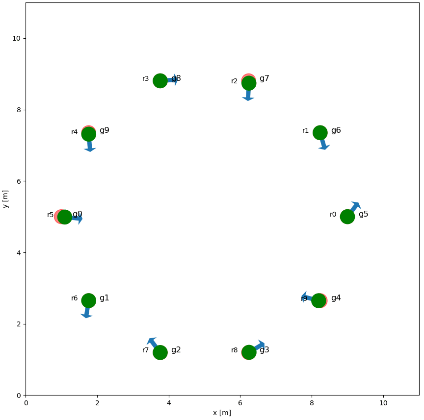
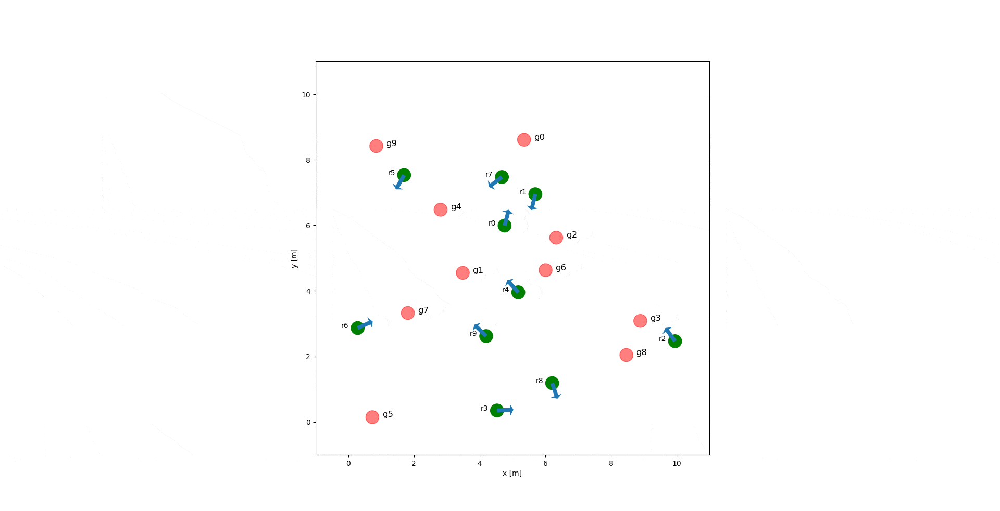

# rl_rvo_nav

## Introduction

This repository is the source code of the paper "Reinforcement Learned Distributed Multi-Robot Navigation with Reciprocal Velocity Obstacle Shaped Rewards" [RA-Letter] 

**[`PDF_ieee`](https://ieeexplore.ieee.org/document/9740403)** | **[`PDF_arxiv`](https://arxiv.org/pdf/2203.10229.pdf)** | **[`Video_Youtube`](https://www.youtube.com/watch?v=-8a8Vqm6epM)** | **[`Video_Bilibili`](https://www.bilibili.com/video/BV1oS4y1U71B?spm_id_from=333.999.0.0)**

Circle 10                  |   Circle 16       | Circle 20 
:-------------------------:|:-------------------------:|:-------------------------:
  |  | 

Random 10                  | Random 16  | Circle 20 
:-------------------------:|:-------------------------:|:-------------------------:
 |  | 

## Prerequisites

- Python >= 3.8
- Pytorch >= 1.6.0
- [intelligent-robot-simulator](https://github.com/hanruihua/intelligent-robot-simulator) == v2.5

```
git clone -b v2.5 https://github.com/hanruihua/intelligent-robot-simulator.git
cd intelligent-robot-simulator
pip install -e .
```

## Test environment

- Ubuntu 20.04, 18.04
- Windows 10, 11

## Installation

```
git clone https://github.com/hanruihua/rl_rvo_nav.git
cd rl_rvo_nav
./setup.sh
```

## Policy Train

- First stage: circle scenario with 4 robots.

```
python train_process.py --use_gpu
```

or

```
python train_process_s1.py
```

- Second state: continue to train in circle scenario with 10 robots.

```
python train_process.py --robot_number 10 --train_epoch 2000 --load_name YOUR_MODEL_PATH --use_gpu --con_train
```

or

```
python train_process_s2.py
```

## Policy Test

You can test the policy trained from the previous steps by following command:

```
python policy_test.py --robot_number 10 --dis_mode 3 --model_name YOUR_MODEL_NAME --render
```

**Note1:** dis_mode, 3, circle scenario; 2 random scenario   
**Note2:** YOUR_MODEL_NAME refer to the path and name of the check point file in the *policy_train/model_save* folder

## Pretrained model

We provide the pre_trained model, you can test this model by following command:

```
python policy_test_pre_train.py --render
```

## Citation

If you find this code or paper is helpful, you can star this repository and cite our paper:

```
@article{han2022reinforcement,
  title={Reinforcement Learned Distributed Multi-Robot Navigation With Reciprocal Velocity Obstacle Shaped Rewards},
  author={Han, Ruihua and Chen, Shengduo and Wang, Shuaijun and Zhang, Zeqing and Gao, Rui and Hao, Qi and Pan, Jia},
  journal={IEEE Robotics and Automation Letters},
  volume={7},
  number={3},
  pages={5896--5903},
  year={2022},
  publisher={IEEE}
}
```

## Author

Han Ruihua  
Contact: hanrh@connect.hku.hk


